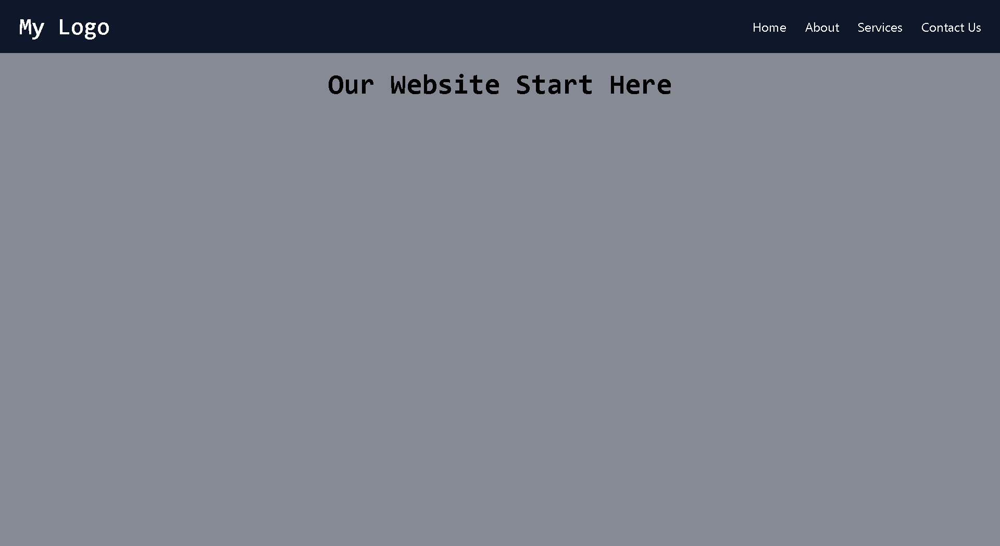

# 📱 Responsive Navbar (React + Tailwind CSS)

A clean and fully responsive **Navigation Bar** built with **React + Tailwind CSS**.  
Works seamlessly on both desktop and mobile devices with a **hamburger menu** for small screens.

---

## 🚀 Features

- 🖥️ **Desktop view** → Inline navigation links
- 📱 **Mobile view** → Hamburger (`☰`) that toggles a dropdown menu
- 🎨 Styled with Tailwind CSS
- 🔄 State management with React `useState` for menu toggle
- ✨ Smooth hover effects for links

---

## 📸 Demo Screenshot

Add your screenshot as `screenshot.png` in the project root, then it will show here:

---

📂 Project Structure
src/
├── components/
│ └── Navbar.jsx # Responsive Navbar Component
├── App.jsx # Example usage
└── index.js # Main entry

---
